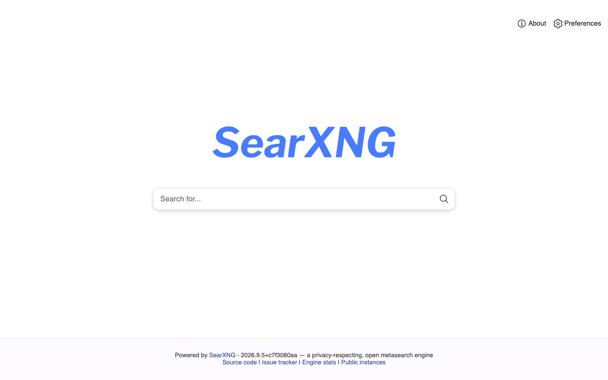
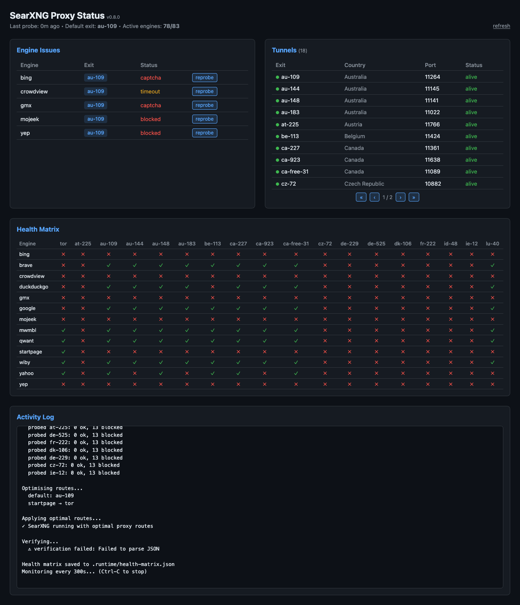

# SearXNG-Local
I use this daily so I update it when I find bugs or add features. My current browser of choice for this is [Zen Browser](https://zen-browser.app/).

---

Run [SearXNG](https://searxng.org) locally using Apple's native [container](https://github.com/apple/container) runtime (macOS) or [Podman](https://podman.io) (GNU/Linux), with a self-managing proxy router across multiple VPN exits and Tor.

SearXNG is a privacy-respecting metasearch engine that aggregates results from 70+ search engines without tracking you. Many engines block requests from known VPN and Tor IP ranges. The bundled proxy manager automatically routes each engine through whichever exit isn't blocking it, monitors for changes, and re-routes on the fly.





## Prerequisites

### macOS (Apple Silicon)

[Apple container](https://github.com/apple/container) - native lightweight-VM container runtime, requires macOS 26 (Tahoe):

```bash
brew install container
brew services start container
container system kernel set --recommended
```

### GNU/Linux

[Podman](https://podman.io/docs/installation):

```bash
# Debian/Ubuntu
sudo apt install podman

# Fedora/RHEL/CentOS
sudo dnf install podman
```

## Quick start

```bash
git clone https://github.com/t0lkim/SearXNG-Local.git
cd SearXNG-Local
chmod +x setup.sh
./setup.sh
```

SearXNG is now running at [http://localhost:8080](http://localhost:8080).

The setup script auto-detects your container runtime (Apple container on macOS, Podman on GNU/Linux).

## Proxy routing

The proxy manager routes each search engine through the best available exit (VPN or Tor), avoiding IP-based blocking. It requires:

- [Bun](https://bun.sh) runtime
- [wireproxy](https://github.com/pufferffish/wireproxy) (`go install github.com/pufferffish/wireproxy/cmd/wireproxy@latest`)
- [Tor](https://www.torproject.org/) running locally (`brew install tor && brew services start tor`)
- One or more WireGuard `.conf` files (e.g. from ProtonVPN) dropped into `vpn-configs/`

When `vpn-configs/` contains `.conf` files, `./setup.sh` automatically starts the proxy watch in the background alongside the container. `./setup.sh stop` stops both. Log output goes to `.runtime/proxy-watch.log`.

For manual control:

```bash
./setup.sh proxy start   # Start server, tunnels, probe, monitor (foreground)
./setup.sh proxy status  # Show current health matrix
./setup.sh proxy probe   # Run a one-off health probe
./setup.sh proxy stop    # Stop VPN tunnels
```

### How it works

1. Spawns a wireproxy SOCKS5 instance for each `.conf` file in `vpn-configs/`
2. Checks every tunnel on the path search uses: from inside the SearXNG container, with SearXNG's own HTTP client, through the same proxy URL written into `settings.yml`. A tunnel is **up** only if a request through it returns an exit IP that differs from your own
3. Probes every engine through every up tunnel, the same way
4. Picks the up tunnel that serves the most engines as the default, and routes engines blocked there to a tunnel where they work
5. Writes the settings into the container, restarts SearXNG and reads the file back; only a byte-identical read-back counts as applied
6. Every 5 minutes, re-checks every tunnel and restarts any that carry no data; re-probes engines and re-routes when routes go stale, configs change, or 30 minutes pass

It fails closed. Search through `:8080` returns 503 with the reason until routes are applied, and whenever no tunnel carries data SearXNG is pointed at a blackhole proxy. It never falls back to searching from your own IP. The gate covers `:8080`; SearXNG itself also answers on `127.0.0.1:8082` and on the container VM address, but its settings always route through a tunnel or the blackhole, so those paths cannot egress directly either. The default `radio browser` engine is removed because it resolves DNS outside the proxy at startup.

The dashboard, `/api/status` and `./setup.sh proxy status` read `.runtime/health-matrix.json`, which holds each tunnel's status, exit IP, country and check time, the engine matrix, the routes and the last apply result. Each tunnel logs to `.runtime/logs/wp-<name>.log`.

**Apple container networking:** the SearXNG VM cannot reach the Mac's loopback, so tunnels listen on the vmnet gateway (the host-only bridge shown by `container network list`), which is not exposed to your LAN. Tor stays on loopback; the manager relays the gateway's port 9050 to it, so no `torrc` change is needed.

**Connection limits:** each `.conf` in `vpn-configs/` holds one VPN connection open for as long as the manager runs, and counts against your provider's simultaneous-connection limit alongside your other devices. Configs beyond the limit can complete a handshake yet carry no data; keep the count within what your plan allows. Tunnels that carry no data are restarted with backoff (up to about once an hour) so they do not keep opening new sessions.

**Note:** Bing serves Cloudflare Turnstile challenges to all known VPN and Tor IP ranges, so it will usually show as blocked in the health matrix. This is a Bing-side restriction with no workaround through proxy routing.

## Usage

```bash
./setup.sh               # Create and start (or start if already created)
./setup.sh stop          # Stop the container
./setup.sh restart       # Stop and start everything
./setup.sh update        # Pull latest image and recreate (preserves settings)
./setup.sh logs          # Show container logs
./setup.sh status        # Show container status
./setup.sh proxy [cmd]   # Manage VPN/Tor proxy routing (see above)
./setup.sh teardown      # Remove container (preserves settings volume)
./setup.sh reset         # Remove container AND settings (destructive)
./setup.sh help          # Show all commands
```

### AI overview (optional)

Results pages can show a short AI answer above the results, like the overview on Google, built only from the results on that page, with numbered citations linking to them and a follow-up box. It is off by default. To enable it, create `local.env` next to `setup.sh` (gitignored):

```bash
SEARXNG_AI_PROVIDER=codex        # or: ollama, off
# SEARXNG_OLLAMA_MODEL=llama3.1  # required for ollama
```

- `codex` uses the [Codex CLI](https://github.com/openai/codex) signed in with ChatGPT (`codex login`), so answers come from your ChatGPT plan's Codex allowance. Each answer takes about 10 to 20 seconds. Your query and the result snippets go to OpenAI.
- `ollama` uses a local [Ollama](https://ollama.com) model: nothing leaves your machine.

The panel lets you switch provider per query. Search results never wait for the answer.

### Status dashboard

When proxy routing is active, visit [http://localhost:8080/stats](http://localhost:8080/stats) for a live dashboard showing whether each tunnel carries data (with exit IP, country and check age), whether the settings applied, engine routing, and the full health matrix. JSON endpoints are available at `/api/status` and `/api/log`.

### Custom bind address

```bash
SEARXNG_BIND=0.0.0.0 ./setup.sh   # Expose to the network (default: 127.0.0.1)
```

## What it does

The setup script:

1. Detects your container runtime (Apple container on macOS, Podman on GNU/Linux)
2. Creates a named volume (`searxng-data`) for persistent configuration
3. Generates a unique `secret_key` and writes `settings.yml` into the volume
4. Pulls the official SearXNG image and starts the container

On subsequent runs it starts the existing container - no duplicate containers, no lost settings.

## Configuration

Settings persist in the `searxng-data` volume. To edit:

```bash
# View current settings (macOS)
container exec searxng cat /etc/searxng/settings.yml

# View current settings (GNU/Linux)
podman exec searxng cat /etc/searxng/settings.yml
```

The bundled `settings.yml` uses SearXNG defaults with `image_proxy` enabled. See the [SearXNG settings documentation](https://docs.searxng.org/admin/settings/) for all options.

## Auto-start (optional)

### macOS (launchd)

With Apple container, the system service runs via `brew services start container`. To start SearXNG and the proxy manager on login:

```bash
./setup.sh install-agent     # generate, install and load the LaunchAgent
./setup.sh uninstall-agent   # remove it
```

The agent runs `searxng-start.sh`, logs to `~/Library/Logs/searxng-local/searxng.log` (the dashboard's activity log shows this file), and relaunches the manager if it exits abnormally, including after its own watchdog trips.

### GNU/Linux (systemd user unit)

Create `~/.config/systemd/user/searxng.service`:

```ini
[Unit]
Description=SearXNG local search
After=default.target

[Service]
Type=oneshot
ExecStart=/path/to/SearXNG-Local/setup.sh
RemainAfterExit=yes
ExecStop=/path/to/SearXNG-Local/setup.sh stop

[Install]
WantedBy=default.target
```

Then enable it:

```bash
systemctl --user daemon-reload
systemctl --user enable --now searxng.service
```

## Updating

```bash
./setup.sh update
```

Pulls the latest SearXNG image. If it's newer than what's running, the container is recreated with the new image. Settings are preserved in the volume.

## Uninstall

```bash
./setup.sh reset                       # Remove container + settings (interactive)
container image delete searxng/searxng # macOS: remove image
# or
podman rmi docker.io/searxng/searxng   # GNU/Linux: remove image
```

Or to keep your settings for later:

```bash
./setup.sh teardown                    # Remove container only
```

## Licence

[MIT](LICENSE)
